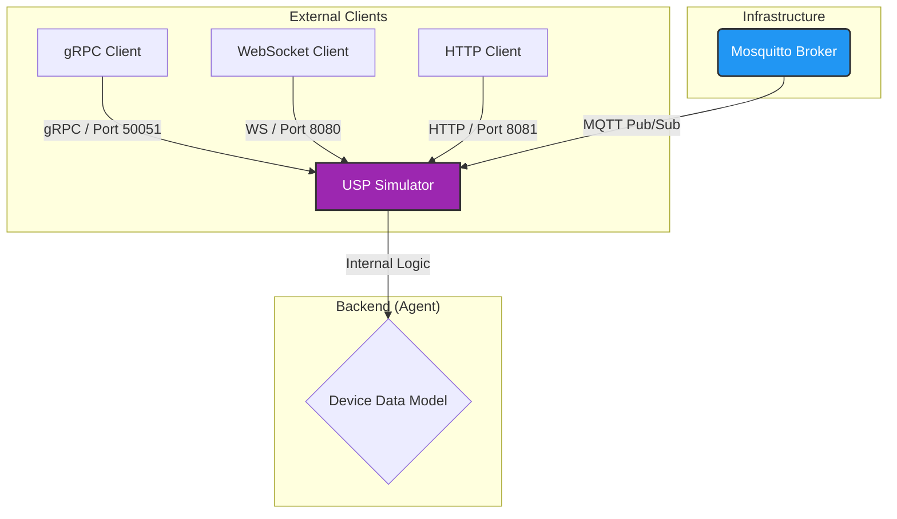

# High-Level Architecture

This document describes the architectural design of the USP Device Simulator, illustrating how external clients can interact with the USP Agent via multiple transport protocols.

## System Overview

The simulator exposes multiple Message Transfer Protocols (MTP) for USP communication: gRPC, WebSocket, HTTP, and MQTT.

## Component Roles

### 1. Mosquitto (Broker)
*   **Role**: The Message Bus for MQTT transport.
*   **Tech Stack**: Eclipse Mosquitto (Docker).
*   **Responsibility**:
    *   Handles standard **MQTT v3.1.1** traffic.
    *   Decouples external MQTT clients from the Agent.

### 2. USP Simulator (Agent)
*   **Role**: The Virtual Device.
*   **Tech Stack**: Dart (Server), TR-181 Data Model.
*   **Responsibility**:
    *   **MTP Layer**: Listens on gRPC (50051), WebSocket (8080), HTTP (8081), and MQTT (via Broker).
    *   **USP Engine**: Decodes Records, processes Messages (Get/Set), and updates the Device Data Model.
    *   **Data Model**: In-memory representation of device state (e.g., `Device.DeviceInfo.SoftwareVersion`).

## Data Flow (Request / Response)

1.  **Client Action**: Client sends a `Get` request for a data model path.
2.  **Encapsulation**: Client creates a `Get` message, wraps it in a `UspRecord` with `to_id="proto::agent"`.
3.  **Transport**: Client sends the Record via any supported MTP (gRPC, WebSocket, HTTP, or MQTT).
4.  **Processing**: Simulator receives the Record, unwraps the `Get` message, queries the Data Model, and creates a `GetResp`.
5.  **Response**: Simulator wraps `GetResp` in a new Record and sends it back through the same transport.

## Deployment Architecture (Docker)

Using `melos run infra:start`, all components run in isolated containers:

| Service | Docker Container | Port (Host Mapping) |
| :--- | :--- | :--- |
| **Broker** | `usp-broker` | `1883` (MQTT), `9001` (WS) |
| **Simulator** | `infrastructure-simulator` | `50051` (gRPC), `8080` (WS), `8081` (HTTP) |
