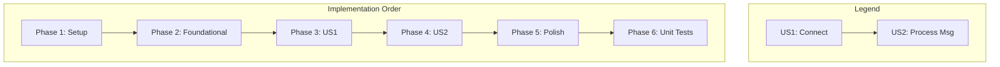

# Actionable Tasks for: MQTT MTP Implementation

**Branch**: `003-implement-mqtt-mtp` | **Date**: 2025-11-25 | **Spec**: [spec.md](./spec.md) | **Plan**: [plan.md](./plan.md)

This task list is designed for execution by an AI agent. It is organized by user story, enabling independent, incremental implementation and testing.

## Phase 1: Setup

- [X] T001 Add `mqtt_client` dependency to the `dependencies` section in `pubspec.yaml`.

## Phase 2: Foundational

- [X] T002 Create the `MqttMtpService` class skeleton in `lib/infrastructure/transport/mqtt_mtp_service.dart`, including placeholder methods for `start`, `stop`, `connect`, `subscribe`, and message handling.

## Phase 3: User Story 1 - Connect to MQTT Broker

**Goal**: As a developer, I want the Simulator to connect to an MQTT Broker so that I can test it in a realistic IoT network topology.
**Independent Test**: Verify that the simulator appears in the MQTT broker's connected client list and is subscribed to the correct agent topic.

- [X] T003 [US1] Implement the `connect` method in `lib/infrastructure/transport/mqtt_mtp_service.dart` to establish a connection with the MQTT broker.
- [X] T004 [US1] Implement the `subscribe` method in `lib/infrastructure/transport/mqtt_mtp_service.dart` to subscribe to the agent topic (`usp/agent/proto::agent`) with QoS 1.
- [X] T005 [US1] Implement the auto-reconnection logic within the `connect` method or a dedicated handler in `lib/infrastructure/transport/mqtt_mtp_service.dart`, as defined in `FR-014`.

## Phase 4: User Story 2 - Process USP Messages

**Goal**: As a developer, I want the simulator to process USP messages received from the MQTT broker and send back responses.
**Independent Test**: Publish a `Get` request to the agent topic and verify that a correct `GetResp` is published to the corresponding controller topic.

- [X] T006 [P] [US2] Implement the message stream listener in `lib/infrastructure/transport/mqtt_mtp_service.dart` to handle incoming messages from the subscribed topic.
- [X] T007 [P] [US2] Implement the message unpacking logic inside the listener in `lib/infrastructure/transport/mqtt_mtp_service.dart` to extract the `UspMsg` DTO using `UspRecordHelper` and `UspProtobufConverter`.
- [X] T008 [US2] In `lib/infrastructure/transport/mqtt_mtp_service.dart`, pass the unpacked DTO to the `UspMessageAdapter` to process the request.
- [X] T009 [US2] In `lib/infrastructure/transport/mqtt_mtp_service.dart`, implement the reply logic to serialize the response DTO into a `UspRecord` and publish it to the correct controller topic with QoS 1. Ensure the `senderId` is correctly formatted (colons to underscores).

## Phase 5: Polish & Cross-Cutting Concerns

- [X] T010 Implement standardized logging (e.g., `📩 [MQTT] RX...`) within `lib/infrastructure/transport/mqtt_mtp_service.dart` for all major events (connection, subscription, message receipt, publication).
- [X] T011 [P] Update `bin/server.dart` to accept a command-line argument (`--mtp mqtt`) to initialize and run `MqttMtpService` instead of the default WebSocket server.
- [X] T012 [P] Create the verification script `bin/verify_server_mqtt.dart`. This script should act as a simple USP Controller to perform an end-to-end test of the MQTT MTP service as described in `quickstart.md`.

## Phase 6: Unit Tests

- [X] T013 Create mock classes for `UspMessageAdapter` and `MqttServerClient` in `test/mocks.dart` for unit testing.
- [X] T014 [P] Write unit tests for the connection logic (`connect` and `_onDisconnected`) in `test/infrastructure/transport/mqtt_mtp_service_test.dart`.
- [X] T015 [P] Write unit tests for the subscription logic (`subscribe`) in `test/infrastructure/transport/mqtt_mtp_service_test.dart`.
- [X] T016 [P] Write unit tests for the message handling logic (`_handleMessage`) in `test/infrastructure/transport/mqtt_mtp_service_test.dart`, covering both successful processing and error cases.
- [X] T017 Run all tests with coverage and ensure that `lib/infrastructure/transport/mqtt_mtp_service.dart` meets the 90% coverage requirement.

## Dependency Graph

The user stories can be implemented sequentially. Phase 3 (User Story 1) is a prerequisite for Phase 4 (User Story 2). Unit tests are created after the implementation is complete.

## Parallel Execution

- Within **Phase 4**, tasks `T006` and `T007` can be developed in parallel as they deal with closely related parts of the message handling logic.
- In **Phase 5**, tasks `T011` and `T012` can be developed in parallel. Modifying the server entry point and creating the verification script are independent activities.
- In **Phase 6**, tasks `T014`, `T015`, and `T016` can be developed in parallel as they test different aspects of the service.

## Implementation Strategy

The implementation will follow a phased, MVP-first approach.
1.  **MVP Scope**: Complete all tasks up to and including **Phase 3 (User Story 1)**. This will deliver a testable piece of functionality: a simulator that can successfully connect and subscribe to an MQTT broker.
2.  **Full Feature**: Complete all remaining phases to deliver the full feature, including message processing and verification.
3.  **Testing**: After the full feature is implemented, write unit tests to ensure quality and meet the 90% coverage goal.
